**This application was prepared using the Rational Unified Process software development process. The entire application is developed with software architecture.**

**Used Software Architecture:** Layered architecture (monolithic)

**Used Software Technologies:** Node.js (Express.js), React.js, Jest (test). MongoDB (Mongoose) → MERN STACK

**Features Included:** API versioning, unit test, layered architecture (presentation, business, data), DTOs, validations, JWT, mail sender (Nodemailer), file upload, Joi, crypto.js, dotenv, authentication, authorization

---

**YOUR DIARY MOOD WEB APPLICATION**

In today's world, increasing psychological issues and addictions lower people's quality of life and joy. The lack of self-awareness due to the ever-growing sea of technology and content is constantly increasing, harming social and individual lives. With the Your Diary Mood application, users can track their emotional states, thoughts, and feelings throughout the day and view the analysis and results. The application contributes to increasing individual awareness.

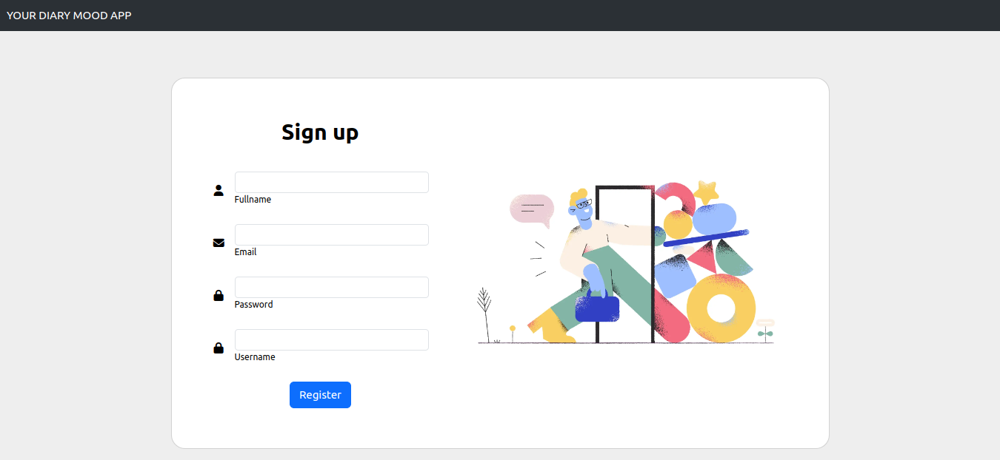

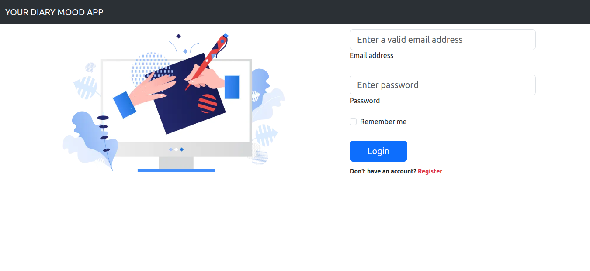

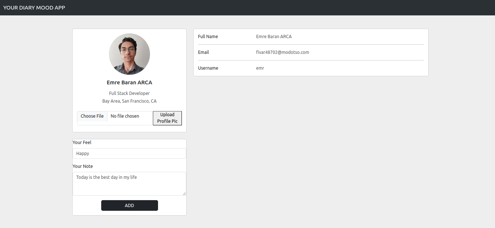

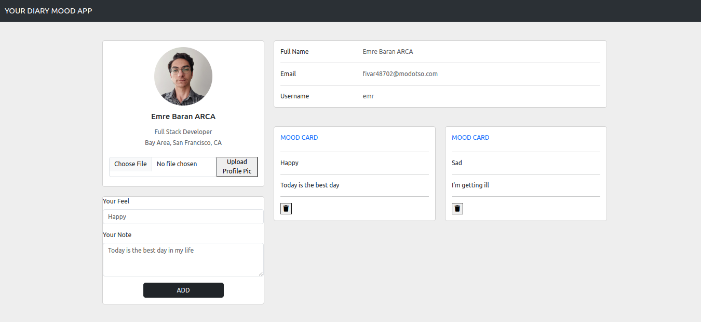

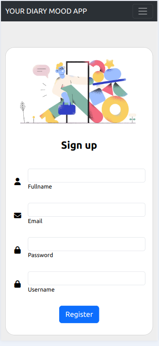

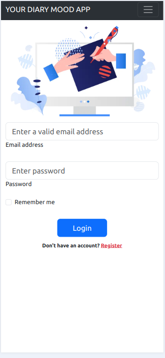

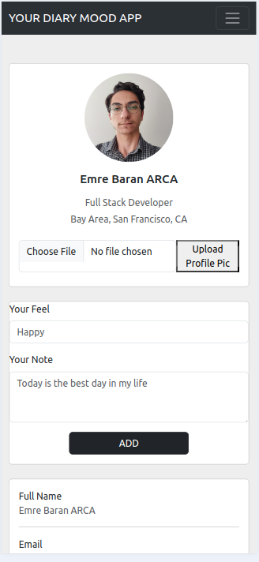

**INCEPTION PHASE**

**Vision**

We will ask users to express their emotional states through the application at specific times. This expression time will be left free for the user, with only reminder notifications permitted as allowed. After reporting their emotions, feelings, and thoughts using emoji expressions, users will be able to see which emotions they experienced throughout the day at the end of the day, raising awareness. Users will be able to track their weekly and monthly emotional changes through the application.

|**ACTOR**|**GOAL**|
| :- | :- |
|User|
Register to the system

Log in to the system

Create an emotion state card
|
|System|
Save user registration information

Verify the user

Save the user's emotion state card

Show the user their emotion state card
|

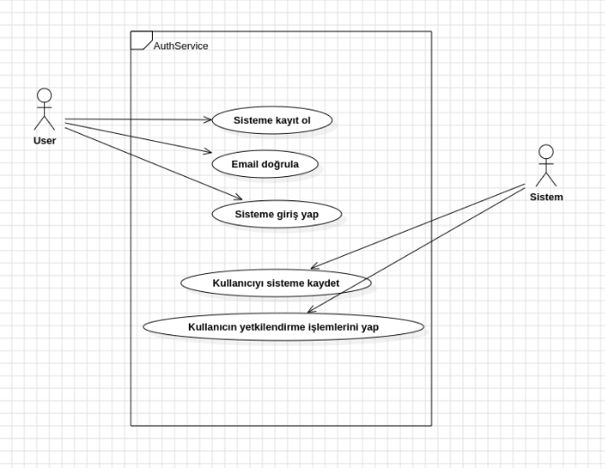

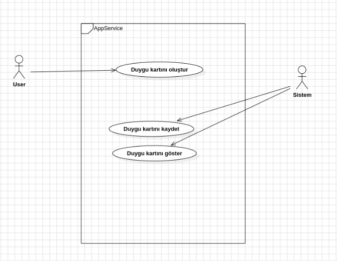

**ELABORATION PHASE**

**Main Success Scenario**

1. The user registers to the system.
2. The system receives the user information.
3. The system sends a verification email to the user.
4. The user verifies the email.
5. The user logs in to the system.
6. The user views the profile page.
7. The user creates an emotion state card.
8. The system saves the emotion state card.
9. The user views the emotion state card.

**System Sequence Diagrams**

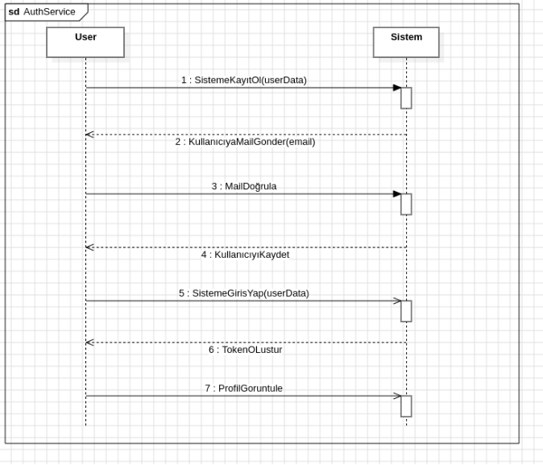

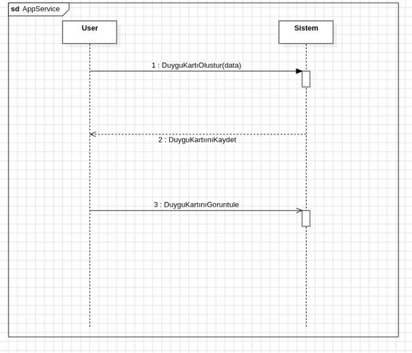

**UML Class Diagram**

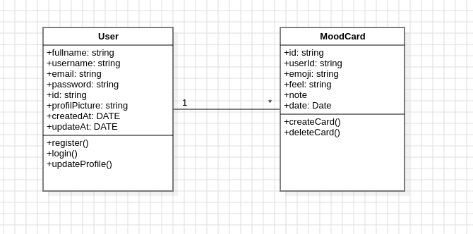

**TRANSITION PHASE**

It is in the development and completion phase. The technologies listed at the beginning are relevant to this phase. The application code has been created. Unit tests have been conducted.

**Used Software Architecture:** Layered architecture (monolithic)

**Used Software Technologies:** Node.js (Express.js), React.js, Jest (test). MongoDB (Mongoose) → MERN STACK

**Features Included:** API versioning, unit test, layered architecture (presentation, business, data), DTOs, validations, JWT, mail sender (Nodemailer), file upload, Joi, crypto.js, dotenv, authentication, authorization
