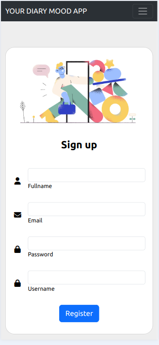
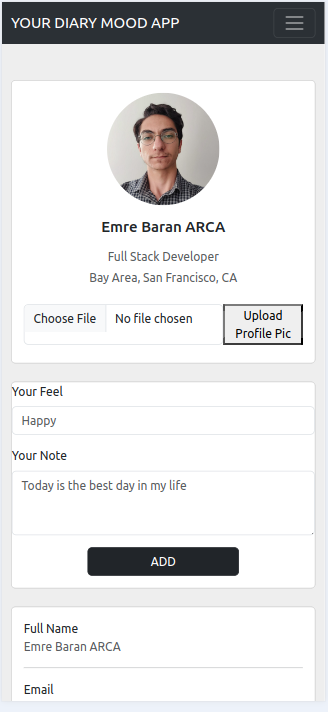
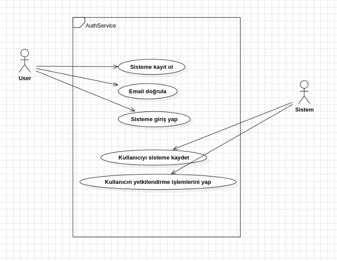
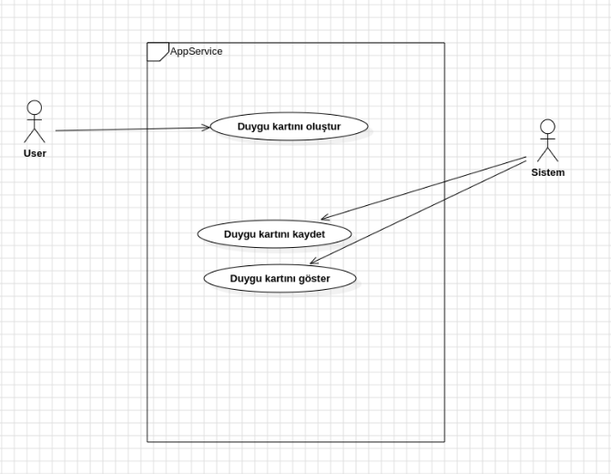
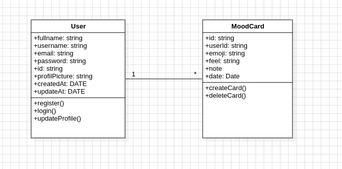

**Bu uygulama rational unified process yazılım geliştirme süreci ile hazırlanmıştır. Tüm uygulama yazılım mimarisi ile geliştirilmiştir.**

**Kullanılan yazılım mimarisi:** Layered architecture (monolithic)

**Kullanılan yazılım teknolojileri:** node.js (express.js), react.js, jest(test). MongoDB (mongoose) →MERN STACK

**İçerisinde bulunan özellikler:** API versioning, unit test, layered architecture(presentation,business,data), DTOs, validations, JWT, mail sender(nodemailer), file upload, joi, crypto.js, dotenv, authentication, authorization

**YOUR DIARY MOOD WEB APPLICATION**

Günümüzde artan psikolojik sorunlar ve bağımlılıklar insanın yaşam kalitesini ve sevincini düşürmektedir. İnsanın kendini bilme ve tanıma noktasında eksikliği artan teknoloji ve içerik denizinden dolayı sürekli artmakta toplumsal ve bireysel yaşama zarar vermektedir. Your Diary Mood uygulaması sayesinde kullanıcılar gün içerisinde yaşadığı duygu durumlarını, neler düşündüklerini ve neler hissettiklerini takip edebilecek, bunun analiz ve sonuçlarını görüntüleyebileceklerdir. Uygulama insanın bireysel farkındalığını arttırmaya katkı sağlamaktadır.

**INCEPTION PHASE** 

**Vision**

Kullanıcıların belirli saatlerde uygulama üzerinden duygu durumlarını ifade etmesini isteyeceğiz. Bu ifade etme vakti kullanıcıya özgür olarak bırakılacak sadece izinler doğrultusunda hatırlatma bildirimleri yapılabilecektir. Emoji ifadeleri ile duygularını, his ve düşüncelerini duygu kartına bildirdikten sonra gün sonunda gün içerisinde hangi duyguları yaşadıklarını görüntüleyecek bunlar üzerinde bir farkındalık gerçekleştirilecektir. Uygulama üzerinden haftalık ve aylık duygu değişimlerini takip edebileceklerdir.

|**ACTOR**|**GOAL**|
| :- | :- |
|User|
Sisteme kayıt ol

Sisteme giriş yap

Duygu durum kartını oluştur
|
|Sistem|
Kullanıcın kayıt bilgilerini sakla

Kullanıcıyı doğrula

Kullanıcının duygu durum kartını kaydet

Kullanıcıya duygu durum kartını göster
|

**ELABORATION PHASE**

**Ana başarı senaryosu**

1. Kullanıcı sisteme kayıt olur.
1. Sistem kullanıcı bilgilerini alır.
1. Sistem kullanıcı mailine doğrulama gönderir.
1. Kullanıcı mail doğrulamasını gerçekleştirir
1. Kullanıcı sisteme giriş yapar.
1. Kullanıcı profil sayfasını görüntüler.
1. Kullanıcı duygu durum kartını oluşturur.
1. Sistem duygu durum kartını kaydeder.
1. Kullanıcı duygu durum kartını görüntüler.

**System Sequence Diagrams**

UML Class diagram

**TRANSITION PHASE**

Geliştirme ve tamamlama aşamasındadır. En başta yazılan teknolojiler bu fazın bilgileridir. Uygulama kodu oluşturuldu. Unit testler yapıldı.

**Kullanılan yazılım mimarisi:** Layered architecture (monolithic)

**Kullanılan yazılım teknolojileri:** node.js (express.js), react.js, jest(test). MongoDB (mongoose) →MERN STACK

**İçerisinde bulunan özellikler:** API versioning, unit test, layered architecture(presentation,business,data), DTOs, validations, JWT, mail sender(nodemailer), file upload, joi, crypto.js, dotenv, authentication, authorization

